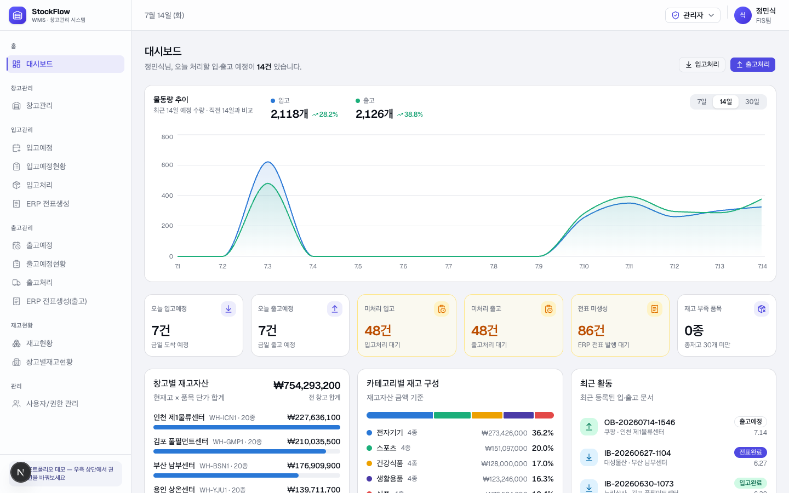
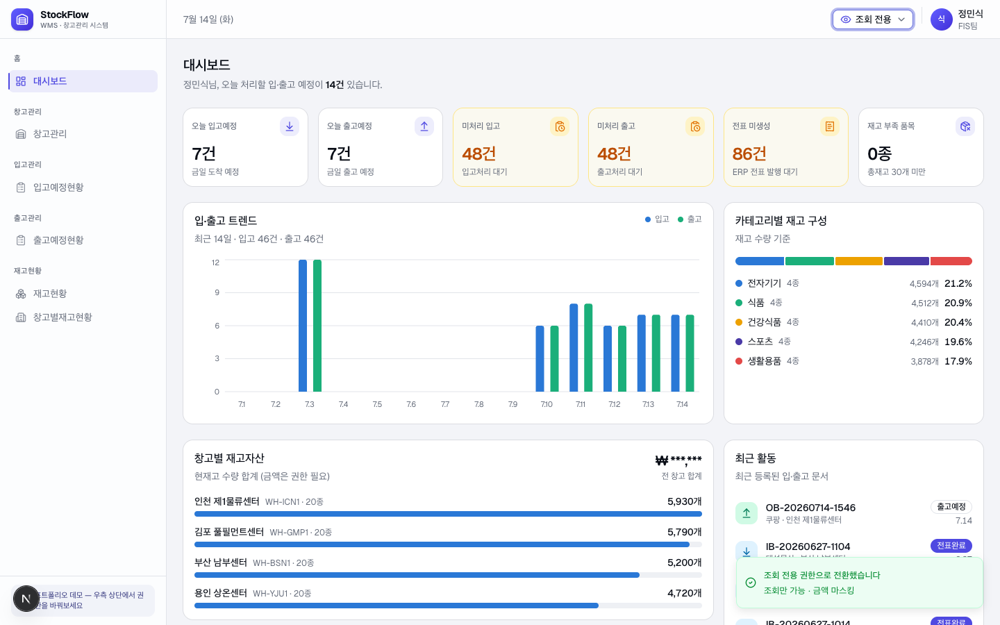
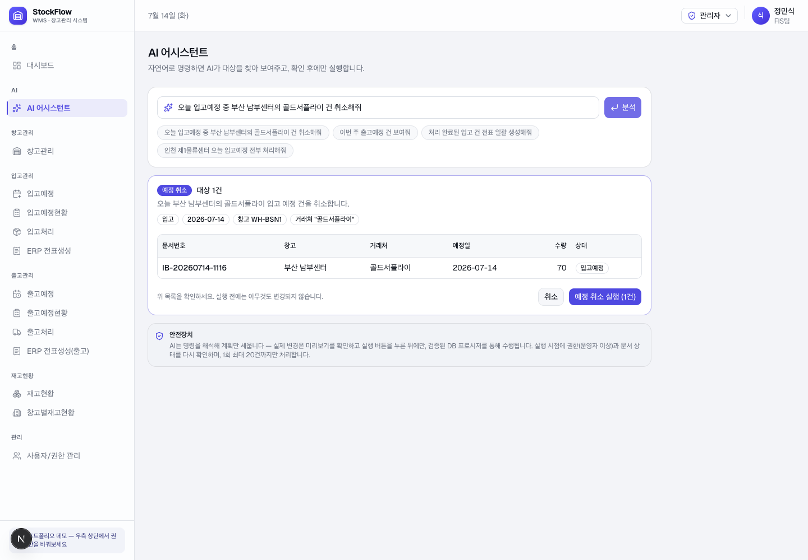
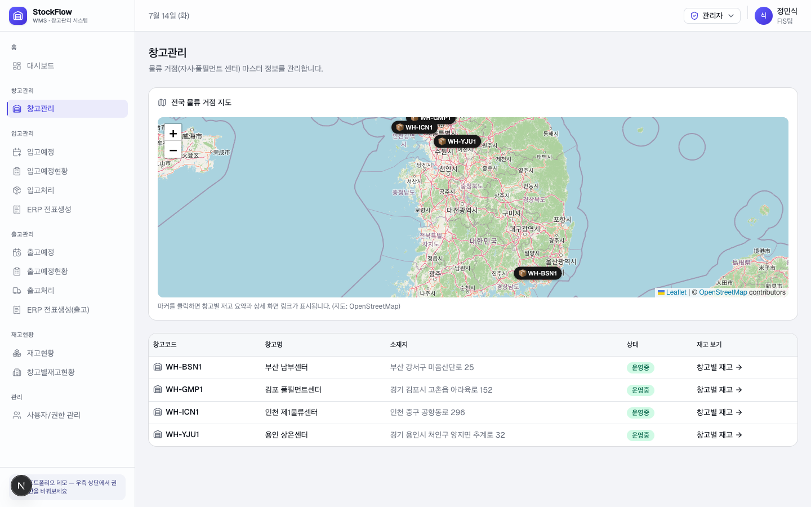
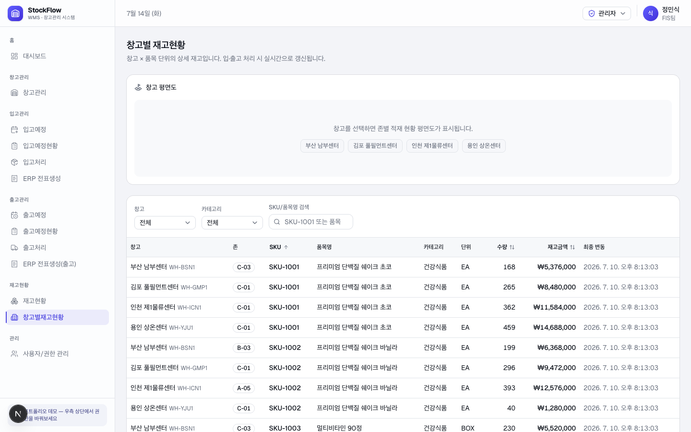

# StockFlow — 커머스·물류 WMS 인트라넷 (포트폴리오 데모)

창고관리(WMS)와 ERP 전표 연동을 다루는 사내 인트라넷 데모입니다.
커머스·물류·재무 도메인의 프론트엔드 직무를 염두에 두고, **실무에서 그대로 요구되는 패턴**
— 서버 사이드 페이지네이션, 권한 기반 UI(RBAC), 엑셀 업무의 시스템 전환, 대시보드 —
을 작은 규모 안에 밀도 있게 구현했습니다.



## 데모에서 눌러볼 것들

| 어디서 | 무엇을 |
|---|---|
| **AI 어시스턴트** 메뉴 | "오늘 입고예정 중 부산 남부센터의 골드서플라이 건 취소해줘" 같은 자연어 명령을 Gemini가 구조화된 계획으로 해석 → 대상 문서 미리보기 → 사용자가 확인해야 실행됩니다. |
| 헤더 우측 **권한 스위처** | 관리자 → 조회 전용으로 바꾸면 메뉴가 줄고, 모든 금액이 `₩ ***,***`로 마스킹되고, 처리 버튼이 사라집니다. 새로고침 없이 즉시 반영됩니다. |
| 대시보드 **물동량 추이** | 기간(7/14/30일) 전환, 입고·출고 스탯 블록 클릭으로 계열 숨김/표시, 호버 크로스헤어 툴팁. 서버 재요청 없이 반응합니다. |
| 각 목록의 **엑셀 버튼** | 화면의 10행이 아니라 "현재 필터 조건 전체"를 .xlsx로 내려받습니다. 조회 전용 권한이면 파일 안의 금액도 마스킹됩니다. |
| **입고예정 등록**의 품목 선택 | 타이핑하면 서버에서 SKU/품목명을 검색합니다(전량 로드 없음). ↑/↓/Enter 키보드 선택 지원. |
| **창고관리** 지도 / **창고별재고현황** 평면도 | 지도 마커 → 창고별 재고 요약 → 상세 화면 링크. 평면도의 존을 클릭하면 아래 테이블이 해당 존으로 필터링됩니다. |
| 입고처리 → ERP 전표생성 | 예정 등록 → 실물 수량 확정(재고 반영) → 전표 발행까지 물류 문서의 전체 수명주기를 따라가 볼 수 있습니다. |

### 권한(RBAC) 데모 — 조회 전용으로 전환한 화면

메뉴 축소 · 금액 마스킹 · 차트가 금액 대신 수량 기준으로 자동 전환됩니다.



## 기술 스택

- **Next.js 16 (App Router)** — React Server Components + Server Actions
- **React 19** · **TypeScript**
- **TanStack Query v5** — 서버 상태 캐시, 뮤테이션 후 invalidateQueries
- **Supabase (PostgreSQL)** — RLS + security definer RPC
- **Tailwind CSS v4 + shadcn/ui(Radix)** · **Recharts** · **Leaflet** · **SheetJS(xlsx)**

## 아키텍처에서 신경 쓴 것

**1. 목록은 전부 서버 사이드 페이지네이션**
모든 목록 화면은 "현재 페이지 + 현재 필터"만 가져옵니다(`.range()` + 필터 push-down).
전체 로드 후 클라이언트 필터링은 데이터가 수만 건이 되는 순간 무너지기 때문에,
검색·정렬·기간 필터 모두 쿼리 파라미터로 DB에 내립니다. 검색어는 `useDeferredValue`로
지연시켜 타이핑마다 요청이 나가지 않게 했습니다.

**2. 데이터 변경은 DB가 정합성을 보장**
anon 키는 RLS로 조회만 허용되고, 입고/출고 처리·전표 생성 같은 변경은
security definer RPC(`wms_process_order` 등)를 통해서만 가능합니다.
수량 확정과 재고 가감이 한 트랜잭션에서 처리되므로 프론트가 실수해도 재고가 어긋나지 않습니다.

**3. RBAC는 서버가 최종 방어선**
메뉴 노출·버튼 숨김은 편의일 뿐이고, 페이지 진입 시 서버 컴포넌트에서 권한을 검증해
미달이면 리다이렉트합니다. 민감 금액은 화면·엑셀 파일 양쪽에서 동일한 정책(`maskAmount`)으로
마스킹됩니다. 데모에서는 쿠키 기반 세션을 흉내 내지만, `lib/auth.ts` 한 곳만 SSO로
교체하면 나머지 권한 분기가 그대로 재사용되는 구조입니다.

**4. 서버/클라이언트 컴포넌트 분리**
데이터 페칭과 초기 렌더는 RSC, 필터·테이블·차트처럼 상태가 있는 영역만 `"use client"`로
격리했습니다. 페이지 전환은 `loading.tsx` 스켈레톤 + 사이드바의 `useOptimistic` 낙관적
하이라이트로 서버 응답을 기다리는 동안에도 즉시 반응하는 것처럼 보이게 했습니다.

**5. 엑셀 내보내기는 청크 배치 조회**
PostgREST의 1회 응답 상한(1,000행)에 맞춰 같은 조회 함수를 청크로 반복 호출해
필터 조건 전체를 모으고, 10,000행 상한으로 브라우저를 보호합니다.
SheetJS는 내보내기 시점에만 동적 import 되어 초기 번들에 포함되지 않습니다.

**6. AI 어시스턴트 — LLM에게 실행 권한을 주지 않는다**
LLM(Gemini)의 역할은 자연어를 화이트리스트 액션 + 필터 조건의 JSON 계획으로
변환하는 것까지입니다. 서버가 그 조건으로 대상을 조회해 미리보기(dry-run)를 보여주고,
사용자가 실행 버튼을 눌러야만 — 그 시점에 권한(OPERATOR+)·문서 상태를 재검증하고
1회 20건 상한 안에서 — 기존 security definer RPC로 실행합니다.
LLM 출력도 외부 입력으로 취급해 서버에서 스키마 검증을 한 번 더 거칩니다.



## 실행 방법

```bash
# 1. 의존성 설치
npm install

# 2. 환경 변수 — .env.local 생성 (.env.example 참고)
NEXT_PUBLIC_SUPABASE_URL=https://<project>.supabase.co
NEXT_PUBLIC_SUPABASE_ANON_KEY=<anon key>
GEMINI_API_KEY=<gemini api key>   # AI 어시스턴트용 (서버 전용)

# 3. DB 초기화 — Supabase Dashboard > SQL Editor에서 순서대로 1회 실행
#    supabase/wms-seed.sql          (스키마 + RPC + 시드 데이터)
#    supabase/02-warehouse-map.sql  (창고 좌표 + 존/평면도)
#    supabase/03-ai-assistant.sql   (예정 취소 RPC — AI 어시스턴트)

# 4. 개발 서버
npm run dev
```

DB를 초기화하지 않고 접속하면 대시보드가 세팅 안내 카드를 대신 보여줍니다.

## 폴더 구조

```
app/
  (dashboard)/          # 인트라넷 레이아웃 라우트 그룹 (사이드바+헤더)
    dashboard/          # 메인 대시보드 (KPI·차트·최근 활동)
    assistant/          # AI 어시스턴트 (자연어 → 미리보기 → 확인 실행)
    inbound/            # 입고: 예정 등록 → 현황 → 처리 → ERP 전표
    outbound/           # 출고: 동일 흐름
    inventory/          # 재고현황 / 창고별재고현황(평면도)
    warehouses/         # 창고 마스터 + 물류 거점 지도
    management/users/   # 사용자/권한 관리 (ADMIN 전용)
    loading.tsx         # 공용 로딩 스켈레톤 (즉시 화면 전환)
  actions.ts            # Server Actions (데모 권한 전환)
  ai/actions.ts         # AI Server Actions (계획 수립 dry-run / 검증 후 실행)
components/
  layout/               # 사이드바·헤더·권한 스위처·낙관적 내비게이션
  dashboard/            # 히어로 차트·구성비·바 리스트·활동 피드
  ai/                   # AI 어시스턴트 화면 (미리보기·실행 결과)
  wms/                  # 목록 테이블·필터·콤보박스·엑셀 버튼·지도·평면도
  ui/                   # shadcn/ui 프리미티브
hooks/use-wms.ts        # TanStack Query 훅 (조회/뮤테이션)
lib/
  wms/api.ts            # 데이터 액세스 레이어 (페이지네이션·검색·RPC 호출)
  ai/gemini.ts          # Gemini 구조화 출력 파서 (서버 전용, 출력 재검증)
  export.ts             # 엑셀 내보내기 (청크 조회 + xlsx 생성)
  rbac.ts               # 권한 정책 단일 소스 (메뉴·가드·마스킹 공용)
  auth.ts               # 세션 조회 (SSO 교체 지점)
supabase/               # 스키마·RPC·시드 SQL
```

## 화면 더 보기

| 전국 물류 거점 지도 | 창고별 재고 + 존 평면도 |
|---|---|
|  |  |

---

> 이 프로젝트는 학습·포트폴리오 목적의 데모입니다. 데이터는 모두 가상이며,
> 사용자 인증은 데모 편의를 위해 쿠키 기반 권한 전환으로 대체되어 있습니다.
